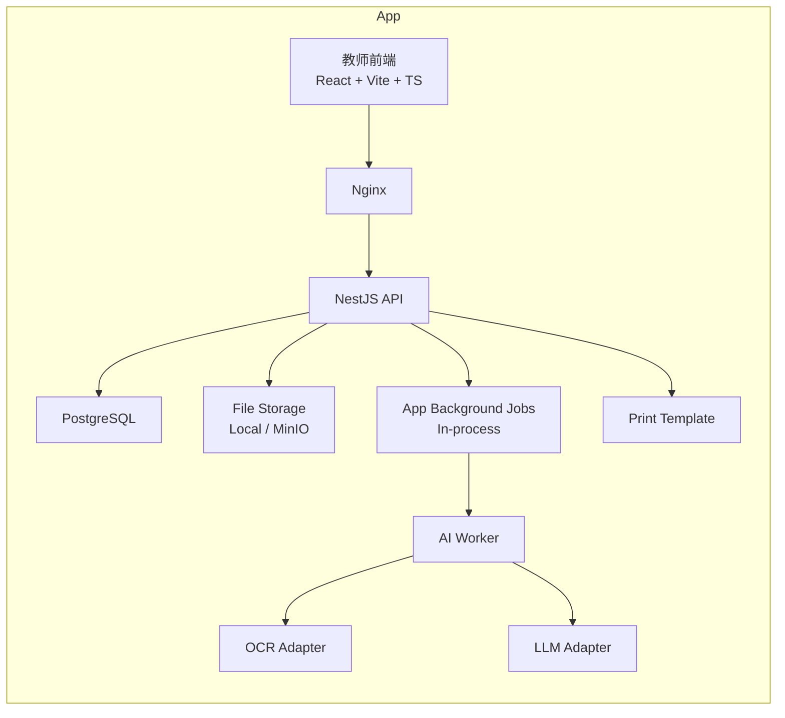
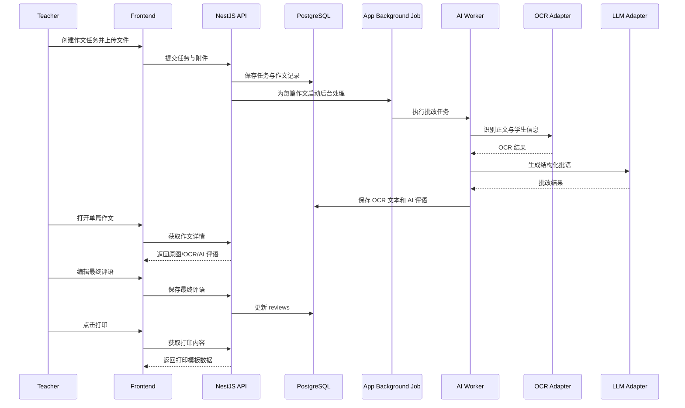
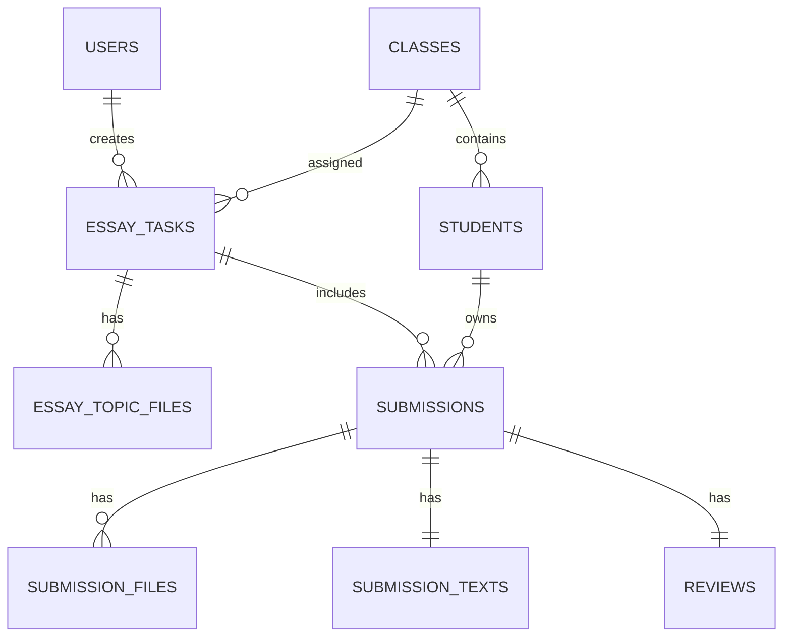

# 作文批改平台架构设计文档（MVP 版）

## 1. 文档信息

- 系统名称：作文批改平台
- 文档版本：v1.0
- 文档类型：架构设计文档
- 编写日期：2026-04-21

## 2. 架构目标

本系统采用“前后端分离 + 后台 AI 处理”的架构，目标如下：

- 支撑 MVP 核心链路稳定运行
- 保证后续可扩展为作文管理平台
- 降低首版开发复杂度
- 让 AI、OCR、打印、业务模块边界清晰

## 3. 总体架构

## 3.1 架构概览



## 3.2 设计原则

- 前端一个项目，避免教师端和管理端分裂成两套代码
- 后端一个主服务，避免过早微服务化
- AI 批改在后台执行，避免接口阻塞
- 业务实体拆分清晰，避免后期难以扩展
- AI/OCR 接入使用适配器层，便于替换
- MVP 首版不强依赖 Redis，后期可无缝升级为队列模式

## 4. 技术选型

## 4.1 前端

- 框架：React
- 构建工具：Vite
- 语言：TypeScript
- UI：shadcn/ui
- 样式：Tailwind CSS
- 路由：React Router
- 请求管理：TanStack Query
- 本地状态：Zustand
- 打印：react-to-print

选择原因：

- 适合中后台 + 工作台类型页面
- 组件化能力强
- 页面状态复杂时维护成本较低
- shadcn/ui 可控，不会像重后台模板那样束缚设计

## 4.2 后端

- 框架：NestJS
- ORM：Prisma
- 数据库：PostgreSQL
- 鉴权：JWT + bcrypt
- 后台任务：应用内任务调度
- 文件存储：本地磁盘，后续可切换 MinIO/OSS

选择原因：

- 模块化强，适合业务边界清晰的系统
- Prisma 对结构化业务数据开发效率高
- PostgreSQL 适合关系型数据和检索
- 首版使用应用内后台任务，降低环境复杂度
- 后续可引入 Redis + BullMQ 提升批量处理能力

## 4.3 AI 与 OCR

- OCR：通过适配器接入第三方 OCR 服务或本地 OCR 能力
- LLM：通过统一适配器接入大模型服务

原则：

- MVP 不将 OCR/LLM 深度耦合进业务模块
- 外部供应商可替换
- 批改结果统一转为内部结构化格式

## 5. 系统模块设计

## 5.1 前端模块

### auth

- 登录页
- 登录态检查
- 退出登录

### task-center

- 任务列表
- 新建任务
- 任务详情

### submission-workbench

- 单篇作文查看
- 原图预览
- OCR 文本查看与修正
- AI 批语查看
- 教师终稿编辑

### class-student

- 班级管理
- 学生管理

### archive

- 作文历史记录列表
- 基础筛选

### print

- 打印预览
- 打印模板

## 5.2 后端模块

### auth

- 用户登录
- Token 颁发与校验

### users

- 用户基本信息
- 教师账号管理

### classes

- 班级管理

### students

- 学生管理
- 学生与班级关联

### essay-tasks

- 任务创建
- 任务状态查询

### files

- 文件上传
- 文件元数据记录
- 受控访问

### submissions

- 单篇作文记录
- 作文状态流转
- OCR 文本管理

### ai-review

- 组织批改请求
- 保存结构化批语

### jobs

- 提交后台任务
- 任务重试
- 批改状态更新

### print

- 组装打印所需数据
- 输出统一打印结构

### archive

- 历史作文查询
- 按班级/学生/任务筛选

## 6. 核心业务流程

## 6.1 作文批改主链路



## 6.2 状态流转

### 作文记录状态

- `UPLOADED`：已上传
- `OCR_PROCESSING`：OCR 处理中
- `OCR_DONE`：OCR 完成
- `AI_PROCESSING`：AI 批改中
- `AI_DONE`：AI 批改完成
- `REVIEWED`：教师已审核
- `PRINTED`：已打印
- `FAILED`：处理失败

### 任务状态

- `CREATED`
- `PROCESSING`
- `PARTIAL_DONE`
- `DONE`
- `FAILED`

## 7. 数据架构

## 7.1 核心实体关系



## 7.2 数据表设计建议

### users

- `id`
- `username`
- `password_hash`
- `role`
- `display_name`
- `status`
- `created_at`
- `updated_at`

### classes

- `id`
- `name`
- `grade`
- `academic_year`
- `teacher_id`
- `status`

### students

- `id`
- `class_id`
- `name`
- `student_no`
- `gender`
- `status`

### essay_tasks

- `id`
- `teacher_id`
- `class_id`
- `title`
- `topic_text`
- `status`
- `total_count`
- `done_count`
- `failed_count`
- `created_at`

### essay_topic_files

- `id`
- `task_id`
- `file_url`
- `file_type`
- `file_name`

### submissions

- `id`
- `task_id`
- `student_id`
- `detected_name`
- `detected_class`
- `status`
- `reviewed_at`
- `created_at`

### submission_files

- `id`
- `submission_id`
- `file_url`
- `file_type`
- `file_name`
- `page_count`

### submission_texts

- `id`
- `submission_id`
- `ocr_text`
- `corrected_text`
- `text_version`

### reviews

- `id`
- `submission_id`
- `ai_score`
- `ai_summary`
- `ai_strengths`
- `ai_issues`
- `ai_suggestions`
- `ai_rewrite_example`
- `teacher_comment`
- `final_comment`
- `printable_snapshot`
- `updated_at`

## 7.3 可扩展字段预留

后续扩展建议新增：

- `submission_versions`
- `analysis_reports`
- `essay_categories`
- `tags`
- `student_progress_metrics`

## 8. 接口架构

## 8.1 API 风格

- RESTful API
- JSON 作为主要传输格式
- 文件上传使用 multipart/form-data

## 8.2 核心接口清单

### Auth

- `POST /api/auth/login`
- `POST /api/auth/logout`
- `GET /api/auth/me`

### Classes

- `GET /api/classes`
- `POST /api/classes`
- `PATCH /api/classes/:id`

### Students

- `GET /api/students`
- `POST /api/students`
- `PATCH /api/students/:id`
- `POST /api/students/import`

### Essay Tasks

- `GET /api/tasks`
- `POST /api/tasks`
- `GET /api/tasks/:id`
- `POST /api/tasks/:id/topic-files`
- `POST /api/tasks/:id/submissions/upload`

### Submissions

- `GET /api/submissions/:id`
- `PATCH /api/submissions/:id/student-binding`
- `PATCH /api/submissions/:id/text`
- `POST /api/submissions/:id/retry`

### Reviews

- `PATCH /api/reviews/:submissionId`
- `GET /api/reviews/:submissionId/print`

### Archive

- `GET /api/archive/submissions`

## 8.3 返回结构建议

统一响应结构：

```json
{
  "code": 0,
  "message": "ok",
  "data": {}
}
```

错误响应结构：

```json
{
  "code": 1001,
  "message": "submission not found",
  "data": null
}
```

## 9. AI 适配层设计

## 9.1 OCR Adapter

职责：

- 输入文件 URL 或文件二进制
- 返回识别文本、姓名候选、班级候选
- 返回置信度与原始识别结果

接口建议：

- `recognizeEssay(file): OcrResult`

## 9.2 LLM Adapter

职责：

- 输入作文题、作文正文、可选学生信息
- 输出结构化批改结果

接口建议：

- `reviewEssay(input): EssayReviewResult`

输出必须严格映射为以下结构：

- `summary`
- `strengths`
- `issues`
- `suggestions`
- `rewriteExample`
- `score`

## 9.3 Prompt 设计原则

- 明确要求输出 JSON 或结构化字段
- 使用固定字段名
- 区分“AI建议”和“教师终稿”
- 避免过度自由发挥，减少不可控输出

## 10. 后台任务设计

## 10.1 为什么必须后台处理

批量作文处理包含：

- 文件解析
- OCR
- 大模型调用

这些步骤耗时长、波动大，不适合同步请求链路。MVP 首版采用应用内后台任务执行，后续再升级到 Redis 队列。

## 10.2 任务拆分

建议一个作文文件对应一个后台任务：

- `essay-review-job`

任务步骤：

1. 读取作文附件
2. OCR 识别
3. 存储 OCR 结果
4. 调用大模型批改
5. 存储 AI 结果
6. 更新作文状态
7. 回写任务聚合状态

## 10.3 失败重试策略

- OCR 失败可自动重试 1-2 次
- LLM 调用失败可自动重试 1-2 次
- 多次失败后标记为 `FAILED`
- 教师界面可手动触发重试

## 10.4 后续队列化升级路径

当作文量增大或需要更稳定的批量处理时，可将当前后台任务实现替换为 `Redis + BullMQ`：

- Controller 和前端状态轮询逻辑保持不变
- 任务状态字段继续复用
- 只替换 jobs 模块的实现方式
- AI Worker 可从应用内执行迁移为独立队列消费者

## 11. 权限模型

MVP 仅设计两类角色：

- `ADMIN`
- `TEACHER`

### ADMIN

- 管理用户、班级、学生
- 查看全部任务

### TEACHER

- 管理自己创建的作文任务
- 管理本人负责班级的学生作文

### 权限控制原则

- 页面级路由拦截
- 接口级权限校验
- 数据级按 teacher_id/class_id 过滤

## 12. 文件存储设计

## 12.1 文件分类

- 作文题附件
- 学生作文原始附件
- 可选打印快照

## 12.2 存储策略

MVP：

- 本地磁盘存储
- 数据库存相对路径或 URL

后续：

- 切换到 MinIO 或对象存储

## 12.3 文件命名建议

- 按任务 ID 和 submission ID 分目录
- 文件名追加时间戳和随机串，避免覆盖

## 13. 打印架构设计

## 13.1 原则

- 打印模板独立于业务页面
- 打印内容以最终评语为准
- 模板头部固定输出班级和姓名

## 13.2 打印内容结构

- 学生姓名
- 班级
- 作文题目
- 最终评语
- 修改建议
- 参考示例

## 13.3 打印实现方式

MVP 建议：

- 前端渲染专用打印页
- 使用 CSS Print 控制分页和样式

## 14. 部署架构

## 14.1 环境划分

- 开发环境
- 测试环境
- 生产环境

## 14.2 部署形态

MVP 推荐：

- Nginx
- 前端静态资源
- NestJS 服务
- PostgreSQL

可先采用本机部署或简单进程部署。后续如引入 Redis，再升级为 `Docker Compose` 统一部署。

## 14.3 目录与服务关系

```text
/app
  /frontend
  /backend
  /uploads
  docker-compose.yml
```

## 15. 日志与监控

MVP 最少应具备：

- 登录日志
- 文件上传日志
- OCR/AI 任务执行日志
- 失败任务日志

可选增强：

- 接口耗时监控
- 后台任务监控面板

## 16. 风险分析

## 16.1 OCR 风险

- 手写体识别准确率不稳定
- 图片质量直接影响结果

应对：

- 支持教师修正 OCR 文本
- 支持手工绑定学生信息

## 16.2 AI 输出风险

- 评语风格不稳定
- 输出字段不完整

应对：

- 统一 Prompt 模板
- 强制结构化输出
- 设置兜底模板

## 16.3 性能风险

- 大批量上传时后台任务积压

应对：

- 首版使用后台任务逐篇处理
- 作文逐篇处理
- 页面轮询或主动刷新状态
- 后续高并发场景引入 Redis 队列

## 17. 扩展路线

当前架构可平滑扩展到以下能力：

### 阶段一：档案库增强

- 按题目检索
- 按主题分类
- 按教师和班级归档

### 阶段二：班级分析

- 单次作文高频问题统计
- 教学建议自动生成

### 阶段三：学生成长追踪

- 历次作文表现变化
- 长期写作弱项标签
- 进步趋势展示

### 阶段四：修改前后对比

- 学生修改稿上传
- 原稿与修改稿差异分析
- 二次点评与学习效果反馈

## 18. 架构结论

本方案以 MVP 交付为前提，围绕“上传作文、AI 批改、教师修改、打印”构建最短可用链路，同时在以下几个层面保留平台扩展能力：

- 数据模型分层
- AI/OCR 适配器解耦
- 后台任务架构
- 前端模块化组织
- 打印与业务解耦

因此，该架构既适合当前快速落地，也能支撑后续升级为作文管理平台。
